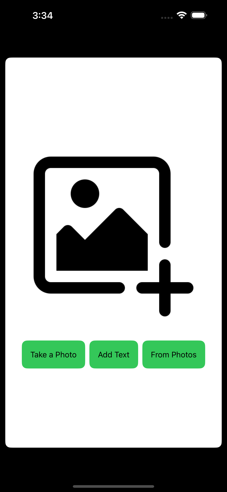
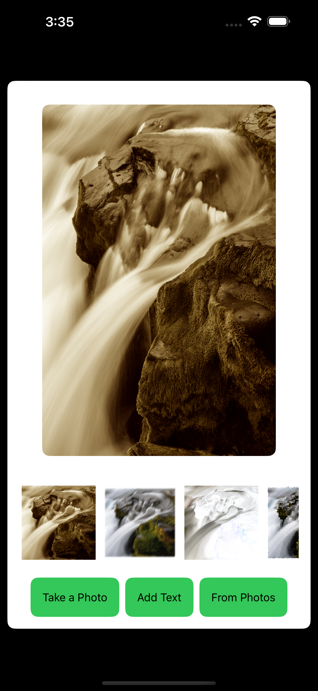
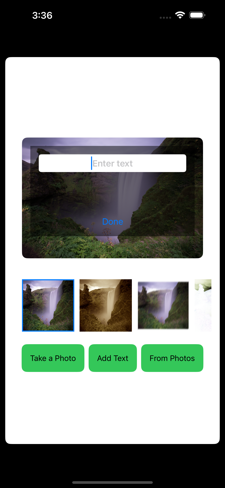

# SwiftUI Image Editor App

Welcome to the SwiftUI Image Editor App! This app allows users to capture or select images from the photo library, add text to them, apply filters, and share the edited images.

## Screenshots

<div style="display: flex; justify-content: center;">
  
  
  
</div>

## Features

- Capture or select images from the photo library.
- Add text to images with customizable font, color, and alignment.
- Apply various filters to enhance images.
- Share edited images via other apps.
- Simple and intuitive user interface.

## Tech Stack

- **Language**: Swift
- **Framework**: SwiftUI
- **Dependencies**: None

## Requirements

- iOS 14.0+
- Xcode 12.0+
- Swift 5.3+

## Installation

1. Clone the repository:

```
git clone https://github.com/bhaveshppatil/PhotoEditorApp.git
```

2. Open the project in Xcode.

3. Build and run the app on your iOS device or simulator.

## Usage

1. Launch the app on your device.
2. Capture an image using the camera or select one from the photo library.
3. Add text to the image by tapping the "Add Text" button and typing your desired text.
4. Customize the text font, color, and alignment as needed.
5. Apply filters to the image by selecting one from the available options.
6. Share the edited image by tapping the "Share" button.

---
